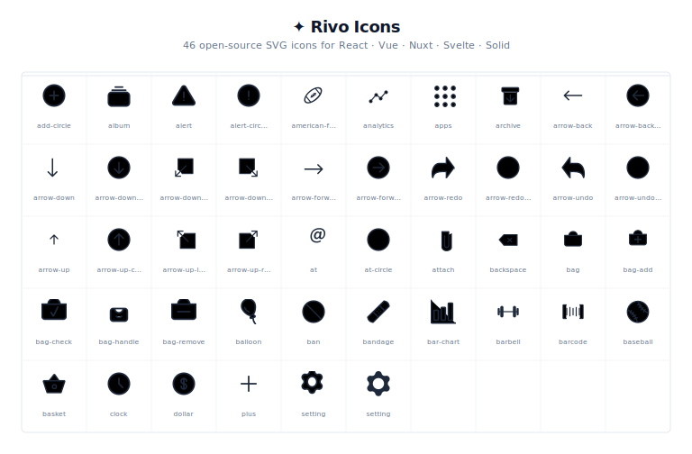

# ✦ Rivo Icons

> Free, open-source SVG icons for React, Vue, Nuxt, Svelte, and Solid.

[](LICENSE)
[](https://github.com/RongMarin99/rivo-icon/tree/main/icons)
[](https://www.npmjs.com/package/@rivo-icons/react)



**46** hand-crafted SVG icons. 24×24 px canvas. 1.5px stroke. `currentColor` throughout. Tree-shakeable. TypeScript types included.

[**Browse Icons →**](https://rivo-icons.dev/icons) · [**Docs →**](https://rivo-icons.dev/docs/getting-started)

---

## Install

Pick the package for your framework:

```bash
# React
npm install @rivo-icons/react

# Vue
npm install @rivo-icons/vue

# Nuxt
npm install @rivo-icons/nuxt

# Svelte
npm install @rivo-icons/svelte

# Solid
npm install @rivo-icons/solid
```

---

## Usage

### React

```jsx
import { Setting, Dollar, Clock } from '@rivo-icons/react'

export default function App() {
  return (
    <div>
      <Setting size={24} />
      <Dollar size={20} color="#6366f1" />
      <Clock />
    </div>
  )
}
```

### Vue

```vue
<script setup>
import { Setting, Dollar } from '@rivo-icons/vue'
</script>

<template>
  <Setting :size="24" />
  <Dollar :size="20" color="#6366f1" />
</template>
```

### Nuxt

Add the module to `nuxt.config.ts`:

```ts
export default defineNuxtConfig({
  modules: ['@rivo-icons/nuxt'],
})
```

Icons are **auto-imported** as global components — no import needed:

```vue
<template>
  <IconSetting />
  <IconDollar />
</template>
```

### Svelte

```svelte
<script>
  import { Setting } from '@rivo-icons/svelte'
</script>

<Setting size={24} />
```

### Solid

```jsx
import { Setting } from '@rivo-icons/solid'

export default function App() {
  return <Setting size={24} />
}
```

### Raw SVG

Copy SVG markup directly from the [icon browser](https://rivo-icons.dev/icons) or from the `icons/` directory.

---

## Props

All icons accept the same props across every framework:

| Prop | Type | Default | Description |
|---|---|---|---|
| `size` | `number \| string` | `24` | Width and height in px |
| `color` | `string` | `currentColor` | Stroke / fill color |
| `strokeWidth` | `number \| string` | `1.5` | Stroke width (outline icons) |
| `className` | `string` | — | CSS class (React / Solid) |
| `class` | `string` | — | CSS class (Vue / Nuxt) |

---

## Icon List

| Name | Variants |
|---|---|
| add-circle | outline |
| album | outline |
| alert | outline |
| alert-circle | outline |
| american-football | outline |
| analytics | outline |
| apps | outline |
| archive | outline |
| arrow-back | outline |
| arrow-back-circle | outline |
| arrow-down | outline |
| arrow-down-circle | outline |
| arrow-down-left-box | outline |
| arrow-down-right-box | outline |
| arrow-forward | outline |
| arrow-forward-circle | outline |
| arrow-redo | outline |
| arrow-redo-circle | outline |
| arrow-undo | outline |
| arrow-undo-circle | outline |
| arrow-up | outline |
| arrow-up-circle | outline |
| arrow-up-left-box | outline |
| arrow-up-right-box | outline |
| at | outline |
| at-circle | outline |
| attach | outline |
| backspace | outline |
| bag | outline |
| bag-add | outline |
| bag-check | outline |
| bag-handle | outline |
| bag-remove | outline |
| balloon | outline |
| ban | outline |
| bandage | outline |
| bar-chart | outline |
| barbell | outline |
| barcode | outline |
| clock | outline |
| dollar | outline |
| plus | outline |
| setting | outline · filled |

---

## Contributing

### Add a new icon

1. Place your SVG file in `icons/outline/` or `icons/filled/`
2. Run the pipeline:
   ```bash
   pnpm icons:generate
   ```
3. The script auto-normalizes the icon to 24×24 px and generates components for all frameworks.

### SVG requirements

- `viewBox="0 0 24 24"`
- `fill="none"` on root `<svg>`
- All strokes/fills use `currentColor` — no hardcoded colors
- Stroke weight ~1.5 px (outline icons)

The pipeline (`scripts/optimize.ts`) will auto-fix most issues — wrong viewBox, baked transforms, design-tool artifacts — and report anything it can't resolve.

### Run the docs site locally

```bash
pnpm install
pnpm dev          # starts all packages in watch mode
# or
cd apps/docs
pnpm dev          # docs site only at http://localhost:3000
```

### Project structure

```
rivo-icon/
├── icons/
│   ├── outline/        # stroke-based SVG source files
│   ├── filled/         # fill-based SVG source files
│   └── brands/         # brand icons (coming soon)
├── packages/
│   ├── react/          # @rivo-icons/react
│   ├── vue/            # @rivo-icons/vue
│   ├── nuxt/           # @rivo-icons/nuxt
│   ├── svelte/         # @rivo-icons/svelte
│   ├── solid/          # @rivo-icons/solid
│   └── shared/         # shared TypeScript types
├── apps/
│   └── docs/           # documentation website (Nuxt 3 SSR)
└── scripts/
    ├── optimize.ts     # SVG normalization + SVGO pipeline
    ├── validate.ts     # SVG compliance checks
    └── generate.ts     # component code generation
```

### Pipeline commands

```bash
pnpm icons:generate    # optimize → generate components
pnpm icons:build       # optimize → validate → generate
pnpm build             # build all packages (turbo)
pnpm dev               # dev mode with watch (turbo)
```

---

## Design decisions

**Why `currentColor`?**
Icons inherit text color automatically. No prop needed for the most common case — just set `color` in CSS.

**Why 24×24 px?**
Industry standard. Matches Material Icons, Heroicons, Lucide, and Tabler. Scales cleanly to 16, 20, 32, 48 px with `size` prop.

**Why separate packages per framework?**
Tree-shaking works best when the bundler sees only the framework it needs. A single universal package would force every consumer to install Vue + React + Svelte types.

---

## License

MIT © [Rivo Icons](https://github.com/RongMarin99/rivo-icon)
